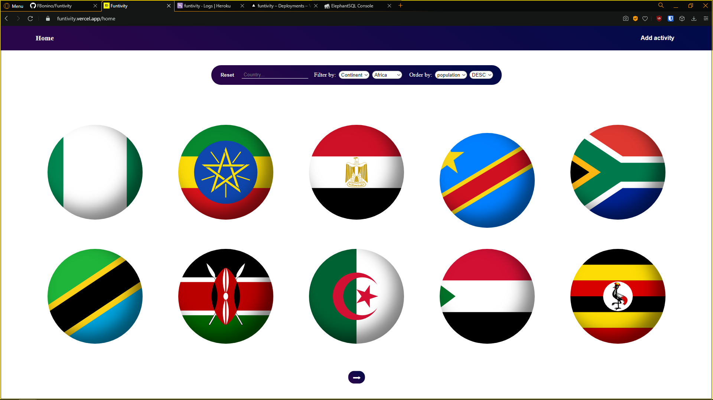
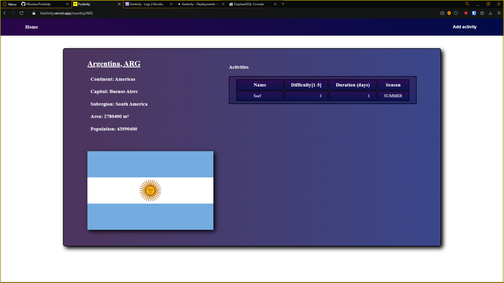

# [Funtivity]()

### About

Project created during Henry's bootcamp as an individual examination instance. Using the [Rest Countries API](https://restcountries.eu/rest/v2/all) I created a database, backend and frontend and later deployed the SPA (single page application) to Vercel, Heroku and ElephantSQL. The app allows the user to add activities (with their difficulty, duration and season when it can be done) and asign them to any country, search for a country by it's name, filter by continent or activity difficulty, order results alphabetically or by the cities population(both ascending and descending), and access a country's details with the activities it has included.

 

### Tecnologies

Frontend:

* ReactJS
* Redux
* CSS
* HTML

Backend:

* NodeJS
* Express

Database:

* PostgreSQL
* Sequelize

 

### Flow

As the landing page is loaded a request to the backend is sent and the database is filled with the countries and their detail fetched from the API. Later, for the results shown in the home page, by default or after applying a filter/order/search, the loaded countries state (contained in a Redux store) updates with the data coming from requests to the backend using url query parameters to get the information the user is looking for. If a user creates an activity a post request is sent that creates an activity or updates it, if it already existed, with the information in the request's body. Finally, when clicking on a country's flag the detail's data comes from the backend where both tables (countries and activities) are joined to get the country's detail and it's activities.

 

### Preview snapshots

<table width = "60%">
	<tr>
		<th> Countries list with filters and orders applied </th>
		<th> Country detail with activities list </th>
	</tr>
	<tr>
		<td>  </td>
		<td>  </td>
	</tr>
</table>

 

### Preview usage

<table width = "60%">
	<tr>
		<th> Search a country by name and filter and order results </th>
		<th> Open city detail and add an activity </th>
	</tr>
	<tr>
		<td>  </td>
		<td>  </td>
	</tr>
</table>

 

### Future updates

* Fix responsiveness (style looks bad at some resolutions)
* Add more features (possibly integrating other APIs) such as country's weather in the detail